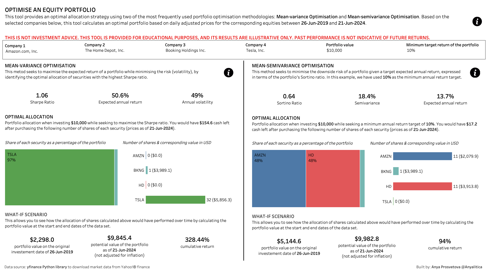
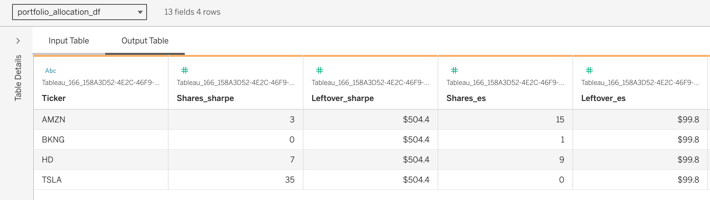

# Build an Investment Portfolio Optimisation Tool with Python in Tableau
## Overview
This tool provides an optimal allocation strategy using two of the most frequently used portfolio optimisation methodologies: Mean-variance Optimisation and Mean-semivariance Optimisation. A user selects 4 different companies they want to invest into and inputs an amount of money they want to invest using parameters at the top of the dashboard, and the Python script calculates the number of shares they should consider buying for each methodology. 

**THIS IS NOT INVESTMENT ADVICE. THIS TOOL IS PROVIDED FOR EDUCATIONAL PURPOSES, AND ITS RESULTS ARE ILLUSTRATIVE ONLY. PAST PERFORMANCE IS NOT INDICATIVE OF FUTURE RETURNS.**

## How it works

This tool is using dynamic parameters in [Table Extensions in Tableau](https://help.tableau.com/current/online/en-us/tc_table_extensions.htm). Table Extensions enable you to create new data sources with Python scripts that are executed via [TabPy server](https://www.tableau.com/developer/tools/python-integration-tabpy). Since Tableau 2024.1, you are also able to dynamically pass parameters from your dashboard to the Python script and regenerate the output. 

### Duck DB
In order to use dynamic parameters in Table Extensions, we should enable [Custom SQL functionality in Tableau](https://help.tableau.com/current/pro/desktop/en-us/customsql.htm). For that we need to connect to a SQL database which contains the data that we need to use as an input for the Python script in the Table Extension. 

In the case of this project, I didn't have any data source I needed to use as an input as the market data for this dashboard is downloaded from [Yahoo! Finance's API using yfinance library](https://github.com/ranaroussi/yfinance/tree/main) every time the Python script is run. So, I decided to use Duck DB database as a light-weight option to enable the Custom SQL functionality in Tableau. Duck DB's website has a good [intro for beginners](https://motherduck.com/blog/duckdb-tutorial-for-beginners/), as well as a detailed [documentation on how to connect to a Duck DB database in Tableau](https://duckdb.org/docs/guides/data_viewers/tableau.html). 

### Custom SQL configuration
Once I connected Tableau Desktop to my Duck DB database, I was able to create a new Table Extension (item 1 in the image below) and add the Custom SQL query (item 2 in the image below) that included only the parameters that I'm going to pass from the dashboard to the Tableau Extension to re-run the script based on the selected parameter values. 

Once this is done, you should be able to see the input table with currently set parameter values in the lower part of the screen (item 3 in the image below). To pass this table to your Python script, you need to call it as **_arg1** and convert it into a Pandas dataframe (item 4 in the image below).

In the case of this project, I needed to retunr two different dataframes for the dashboard:
#### Portfolio_allocation data set

For each optimisation method, this data set returns details about allocation of shares for each selected company you would like to invest, as well as the leftover amount based on the set portfolio value. 

Here is an example of the output table for a selection of companies:

#### Portfolio_summary data set

For each optimisation method, this data set returns a set of major metrics (Sharpe ratio, Sortino ratio, expected annual return, semivariance, annual volatility). 

Here is an example of the output table for a selection of companies:

You can find final Python scripts in the [**python_scripts** folder](https://github.com/anyalitica/tableau-table-extensions-portfolio-optimization/tree/main/python_scripts). Please note that these scripts were tailored to work in Tableau's Table Extensions and will error if run simply as Python scripts outside of Tableau. 

This project was presented at Tableau DataDev Day on June 20, 2024. The recording and slides and detailed blog posts on the architecture will be avialable soon.